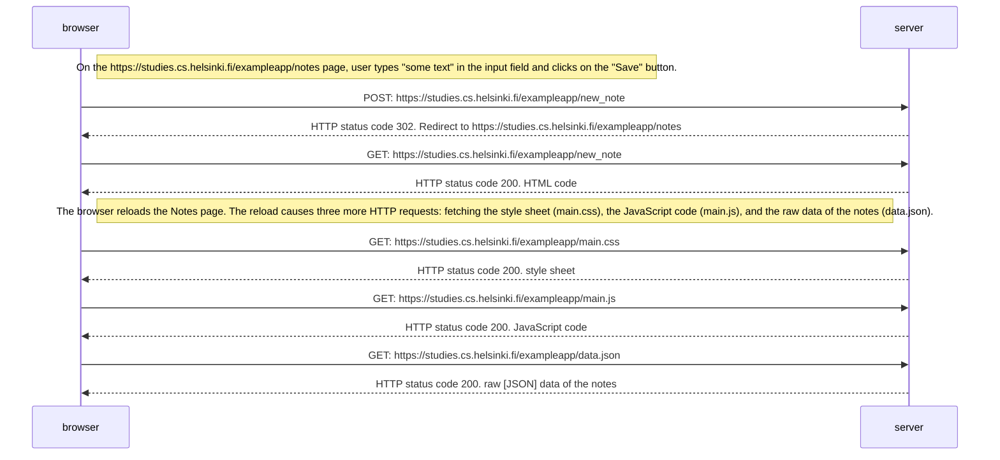

```mermaid
sequenceDiagram

participant browser
participant server

Note right of browser: On the https://studies.cs.helsinki.fi/exampleapp/notes page, user types "some text" in the input field and clicks on the "Save" button.

browser->>server: POST: https://studies.cs.helsinki.fi/exampleapp/new_note
server-->>browser: HTTP status code 302. Redirect to https://studies.cs.helsinki.fi/exampleapp/notes 

browser->>server: GET: https://studies.cs.helsinki.fi/exampleapp/new_note
server-->>browser: HTTP status code 200. HTML code

Note right of browser: The browser reloads the Notes page. The reload causes three more HTTP requests: fetching the style sheet (main.css), the JavaScript code (main.js), and the raw data of the notes (data.json).

browser->>server: GET: https://studies.cs.helsinki.fi/exampleapp/main.css
server-->>browser: HTTP status code 200. style sheet

browser->>server: GET: https://studies.cs.helsinki.fi/exampleapp/main.js
server-->>browser: HTTP status code 200. JavaScript code

browser->>server: GET: https://studies.cs.helsinki.fi/exampleapp/data.json
server-->>browser: HTTP status code 200. raw [JSON] data of the notes


```