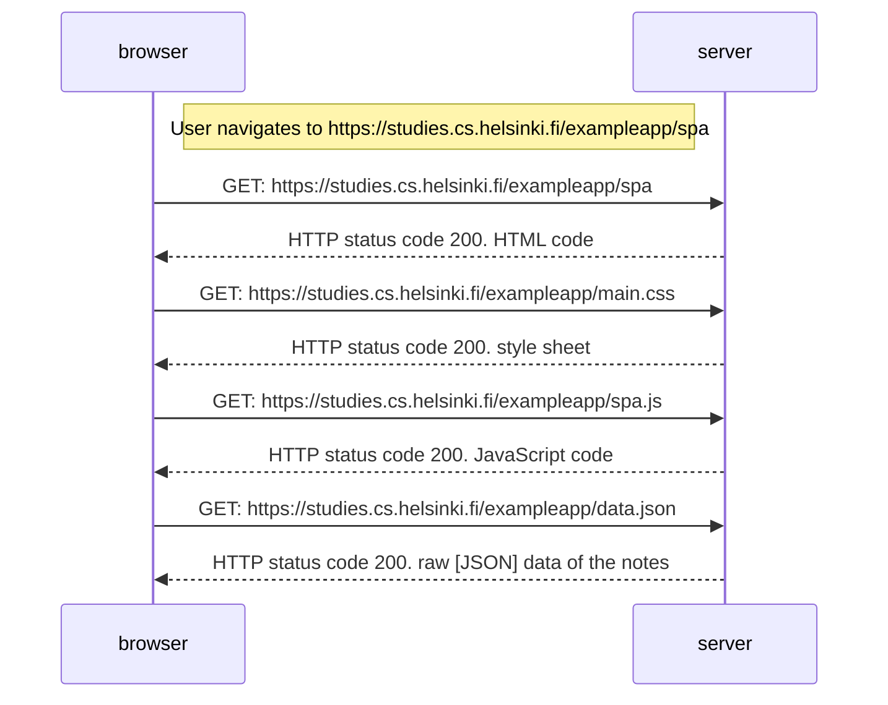

```mermaid
sequenceDiagram

participant browser
participant server


Note right of browser: User navigates to https://studies.cs.helsinki.fi/exampleapp/spa

browser->>server: GET: https://studies.cs.helsinki.fi/exampleapp/spa
server-->>browser: HTTP status code 200. HTML code

browser->>server: GET: https://studies.cs.helsinki.fi/exampleapp/main.css
server-->>browser: HTTP status code 200. style sheet

browser->>server: GET: https://studies.cs.helsinki.fi/exampleapp/spa.js
server-->>browser: HTTP status code 200. JavaScript code

browser->>server: GET: https://studies.cs.helsinki.fi/exampleapp/data.json
server-->>browser: HTTP status code 200. raw [JSON] data of the notes

```