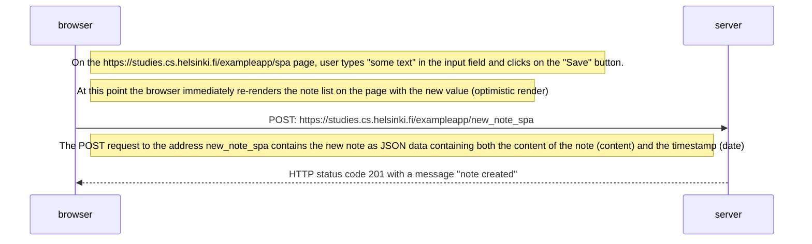

```mermaid
sequenceDiagram

participant browser
participant server

Note right of browser: On the https://studies.cs.helsinki.fi/exampleapp/spa page, user types "some text" in the input field and clicks on the "Save" button.
Note right of browser: At this point the browser immediately re-renders the note list on the page with the new value (optimistic render)

browser->>server: POST: https://studies.cs.helsinki.fi/exampleapp/new_note_spa
Note right of browser: The POST request to the address new_note_spa contains the new note as JSON data containing both the content of the note (content) and the timestamp (date)
server-->>browser: HTTP status code 201 with a message "note created"

```